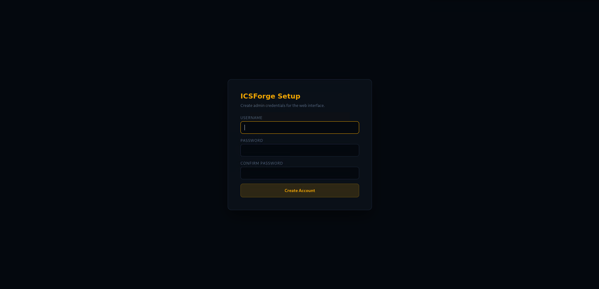
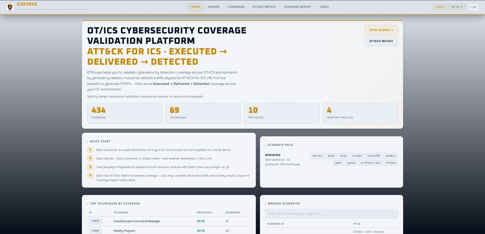
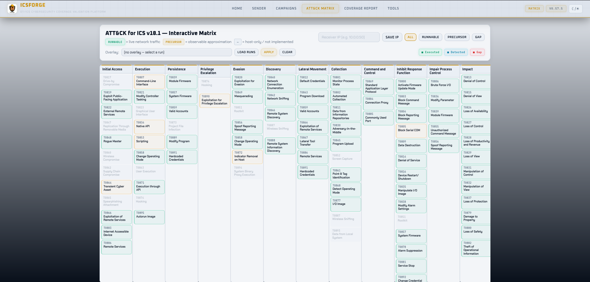
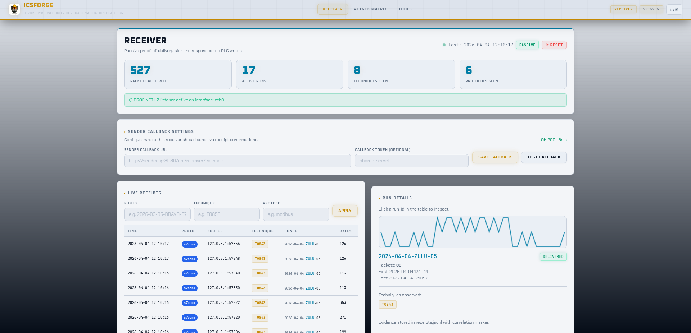
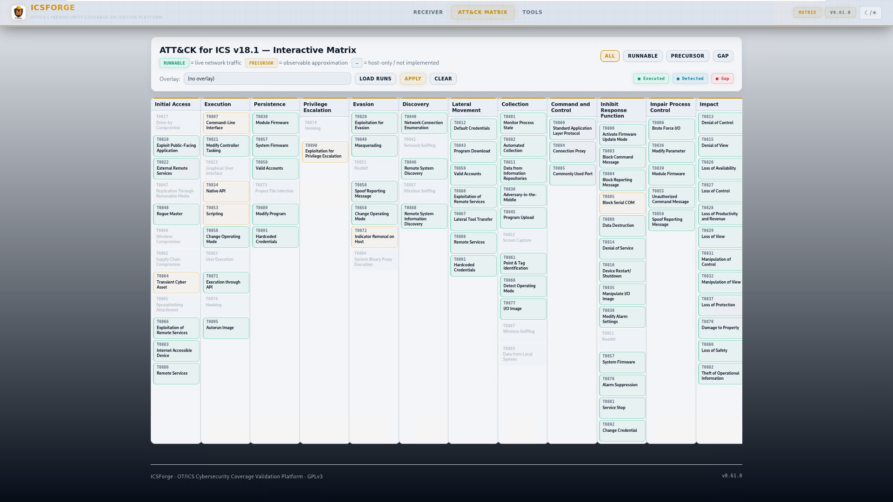
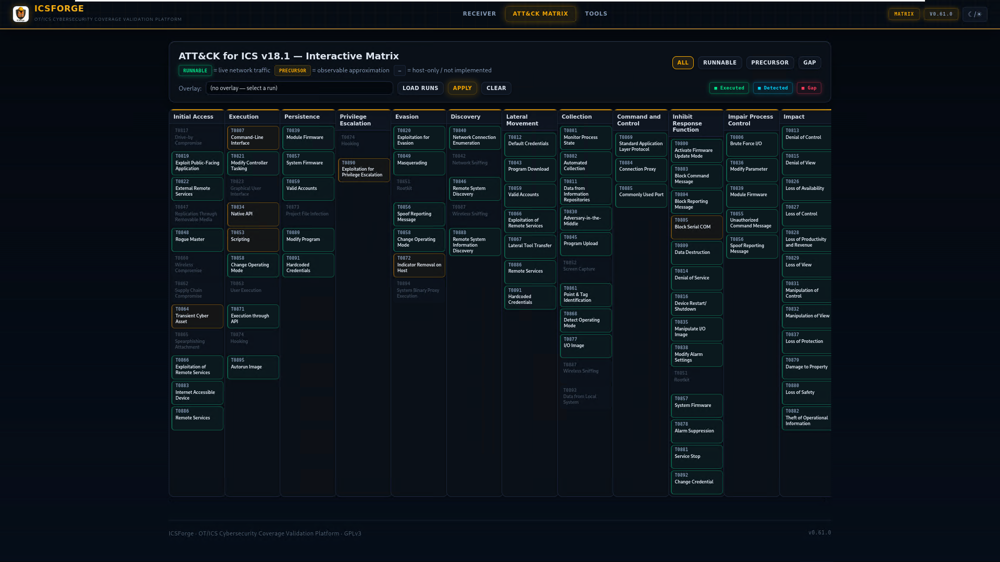

[//]: [](https://github.com/ICSforge/ICSforge/actions/workflows/ci.yml)
[](https://github.com/ICSforge/ICSforge/actions/workflows/ci.yml)
[](https://www.python.org/downloads/)
[](https://www.gnu.org/licenses/gpl-3.0)
[](https://github.com/ICSforge/ICSforge/releases)

**ICSForge™** is an open-source **OT/ICS security coverage validation platform** designed to help defenders, SOC teams, and OT security engineers validate detection, visibility, and readiness against real-world industrial attack techniques.

ICSForge focuses on what can actually be observed on the network and generates realistic OT traffic and PCAPs in **10 industrial protocols (Modbus/TCP, DNP3, S7comm, IEC-104, OPC UA, EtherNet/IP, BACnet/IP, MQTT, IEC 61850 GOOSE, PROFINET DCP)** which are aligned with **77 distinct MITRE ATT&CK ICS technique IDs** spanning 10 industrial protocols (77 of 83 in ATT&CK v18 = 92.8%; in ATT&CK v19 these map to 73 of 79 standalone techniques plus 17 of 18 sub-techniques = 90/97 = 92.8% combined — see [docs/MITRE_V19_CROSSWALK.md](docs/MITRE_V19_CROSSWALK.md)) — without exploiting real systems or causing unsafe process impact — to help asset owners and defenders assess the quality of existing security countermeasures such as firewalls, OT NSM sensors and ACLs and identify hidden gaps.

ICSForge is developed with a **defender-first** and **safe-by-design** approach around a **Sender-Receiver architecture** and interacting with the designated sender and receiver, without the need of touching other OT devices.
By default, live traffic sends are restricted to RFC 1918 / loopback addresses, and PCAP replay is restricted to private ranges unless explicitly unlocked via Tools → Send Policy.
> Most ICS security tools promise coverage - ICSForge lets you **prove it**.
---

## Key Numbers

> Figures below are validated against the code by `scripts/v19_coverage.py --check` on every release, so they track the current build. Run `icsforge --version` to see which version you have; if these numbers ever disagree with `--version`, that is a bug — please report it.

| Metric | Value |
|---|---|
| **Protocols** | 10 industrial protocols (Modbus/TCP, DNP3, S7comm, IEC-104, OPC UA, EtherNet/IP, BACnet/IP, MQTT, IEC 61850 GOOSE, PROFINET DCP) |
| **Runnable Scenarios** | 611 standalone + 16 named attack chains = 627 total |
| **ATT&CK for ICS Techniques Implemented** | 77 unique technique IDs in scenario steps |
| **ATT&CK for ICS Matrix** | v18: 83 standalone techniques · v19 (Apr 2026): 79 standalone + 18 sub-techniques |
| **Mapping confidence** | 457 HIGH (packet directly represents the technique) · 151 MEDIUM (network sees trigger; outcome is host-/process-level) · 19 LOW (packet is a proxy for host/wireless/supply-chain context — see scenario `confidence_rationale` field) |
| **v19 sub-technique annotations** | 111 scenarios carry `technique_v19` field |
| **ATT&CK for ICS Matrix Coverage** | 77 technique IDs (92.8% of v18, 73/79 standalone + 17/18 sub-techniques in v19 = 90/97 = 92.8% combined) — 33 at 10/10 protocols |
| **Detection Rules** | Auto-generated Suricata + Sigma rules per scenario, three tiers (lab marker · protocol heuristic · function-code semantic) |
| **Spec-Cleanliness** | 627/627 scenarios effectively spec-clean (208 clean style-combos + GOOSE upstream-bug-blocked + 1 expected-malformed) per Wireshark/tshark dissection |
| **Markerless attribution** | IEC-104 and stealth (`--no-marker`) runs use receiver expectation registry for callback correlation when no in-band marker is available |

---

## Documentation

| Guide | Covers |
|---|---|
| [`docs/INSTALLATION.md`](docs/INSTALLATION.md) | Traditional (non-Docker) install: venv, the three commands, verification, privileges, config, upgrade, troubleshooting |
| [`docs/USER_MANUAL.md`](docs/USER_MANUAL.md) | Primary web-app walkthrough: Sender/Receiver, run options, firewall/ACL & NSM workflows, detection content (Suricata + Sigma), reviewing results |
| [`docs/CLI_REFERENCE.md`](docs/CLI_REFERENCE.md) | Every CLI command and flag, plus `icsforge-receiver` |
| [`docs/FEATURES_GUIDE.md`](docs/FEATURES_GUIDE.md) | Offline PCAP generator, ATT&CK Matrix view, Campaigns, Receiver console, Tools page, output/artifact formats |
| [`docs/SCENARIO_SCHEMA.md`](docs/SCENARIO_SCHEMA.md) | Scenario file format (for authoring your own) |
| [`docs/SIEM_INTEGRATION.md`](docs/SIEM_INTEGRATION.md) | Wiring alerts into a SIEM |

---

## Architecture

```
┌───────────────────────┐                  ┌──────────────────────┐
│   ICSForge Sender     │  TCP/ UDP / L2   │  ICSForge Receiver   │
│                       │ ─>─>─>─>─>─>─>─> │                      │
│ • Scenario engine     │                  │ • Traffic sink       │
│ • 10 protocol builders│                  │ • Marker correlation │
│ • PCAP generation     │                  │ • Receipt logging    │
│ • Campaign playbooks  │   <── callback   │ • Coverage matrix    │
│ • Web UI (:8080)      │                  │ • Web UI (:9090)     │
└───────────────────────┘                  └──────────────────────┘
           │                                          │
           ▼                                          ▼
     ┌───────────┐                            ┌──────────────┐
     │  ATT&CK   │                            │ Correlation  │
     │  Matrix   │                            │    & Gap     │
     │  Overlay  │                            │  Visibility  │
     └───────────┘                            └──────────────┘
```

**How correlation works:** Every generated packet carries a covert correlation marker woven into a protocol field that is already present and genuinely arbitrary — Modbus transaction ID, ENIP sender context, S7comm PDU reference, OPC UA request handle, BACnet invoke ID. The marker is `HMAC-SHA256(run_key, proto + packet_index)` truncated to the field width, so it costs **zero added bytes** and the packet looks identical to real traffic. When the receiver observes it (verified against the run key / expectation registry), it posts a receipt back to the sender. If the receipt arrives, the packet traversed the wire. If your IDS fires on it, your detection works. Run both to prove **Executed → Delivered → Detected**. (DNP3 and MQTT, which lack a suitable arbitrary field, use a compact 13-byte `ICSF` marker instead; `--explicit-marker` forces that compact marker on all protocols for offline PCAP detection without a receiver.)

**Marker modes** (see [Marker Modes](#marker-modes) for the full table): covert (default), explicit, and stealth, selectable via the **Marker mode** selector in the UI or `--explicit-marker` / `--no-marker` on the CLI. Stealth generates bit-for-bit realistic traffic with no ICSForge tags; confirmation switches to TCP ACK delivery. Use it for IDS/NGFW validation where a marker would betray the test.

---

## Traffic Model & Limitations

**Read this before you trust a result.** ICSForge is a *protocol-traffic generator* for validating content-based detection, firewall/ACL policy, and coverage — not a full device or session emulator. Its fidelity is deliberately scoped, and knowing the boundary tells you which detections you can validate here and which you cannot.

**What ICSForge generates:**

- **Unidirectional traffic — attacker → target only.** Every scenario emits the client/attacker side of the exchange (the `read coils`, the `PLC STOP`, the `Browse` request). It does **not** synthesise the server/PLC responses, ACKs, or error replies that a real device would send back. The pcap contains one direction of the conversation.
- **Stateless at the transport layer (by default).** Offline pcaps carry the application-layer PDU over a crafted TCP/UDP packet, with no TCP handshake (no SYN/SYN-ACK/ACK) and no sequence-number-tracked stream — data packets are emitted as PSH/ACK (`0x0018`). Live `send` opens a real socket to the cooperative receiver (so a real handshake exists on the wire there). **For stateful testing, `generate --stateful` wraps each TCP step in a full conversation** — SYN/SYN-ACK/ACK handshake, per-segment ACKs, FIN/ACK teardown, correct sequence/ack numbers — so the offline pcap survives stream reassembly and exercises stateful IDS engines (Suricata stream, Zeek connection tracking). The covert correlation marker is preserved in stateful mode. The default remains the lighter single-direction model.
- **Application-layer fidelity is the priority, and it is high.** The protocol PDUs themselves are spec-correct and survive independent Wireshark/tshark dissection (see **Spec-Cleanliness** above). The function codes, object structures, service requests, and command semantics are real.

**What this is good for (validate with confidence):**

- Signature/content IDS rules (Suricata/Snort `content:`, Sigma field matches) — *"does my rule fire when someone sends S7 function 0x29?"*
- Firewall / ACL / segmentation policy — *"is Modbus write from this zone actually blocked?"*
- DPI and protocol-aware NGFW classification of OT protocols.
- ATT&CK-for-ICS coverage mapping and detection-gap analysis.

**What this does NOT exercise (do not draw conclusions here):**

- **Response- or outcome-based detection** — rules keyed on a *device's reply* (e.g. an error class returned after an illegal request, an unexpected value in a read response). There is no response traffic to match.
- **Stateful / stream-reassembly detection** — in the default stateless mode, traffic is mid-stream PSH/ACK with no handshake, which a stateful engine may treat differently than a real flow. **Use `generate --stateful`** to emit a full handshake + teardown so stream-reassembly and session-tracking detections can be exercised. (Response-content matching still needs Phase B — see below.)
- **Timing / rate / behavioural analytics** that model full bidirectional conversation dynamics.

**Practical guidance:** treat ICSForge as the tool that answers *"if a malicious ICS command reached my network, would my content rules and firewall catch it?"* — which it answers well, and with `--stateful` it now also drives stream-reassembly and session-tracking detections. The remaining gap is *response-content* matching (rules keyed on a device's reply): a bidirectional/response-traffic mode is the next roadmap item. For those detections today, pair ICSForge with a lab capture of real bidirectional device traffic.

---

## Test Profiles

ICSForge validates different countermeasures in different ways, and the **Test profile** encodes that intent — setting safe defaults and how results are interpreted. It is selected with the **Test profile** control on the Sender page (Firewall / ACL · NSM) or `--profile firewall|nsm` on the CLI. **Profiles never fabricate device responses** — the receiver is always a safe sinkhole, never a simulated PLC.

| | **Firewall / ACL** (default) | **NSM** |
|---|---|---|
| Question answered | Did sender→receiver traffic *arrive*? | Did the sensor *alarm* on the behaviour? |
| Topology | Sender in IT or another OT zone; receiver is a safe sink. Communication should be blocked or limited to certain protocols. | Sender and receiver placed where the path is known-open. |
| Transport | Unidirectional — no handshake assumption | TCP handshake completed (`--stateful` defaulted **on**) so stream-tracking sensors engage |
| The finding | Arrival of any of the 10 protocols = a rule allowed it → investigate the policy. A permitted forward flow does **not** imply the return path is open. | Witnessed traffic is paired with the expected ATT&CK technique, to diff against what the sensor fired. |
| Receiver role | Confirms arrival only | Confirms arrival + records expected-technique for the report |

Why this matters: in a firewall test you must **not** assume return traffic — a misconfiguration that lets the forward flow through may still block the reverse, so treating the run as bidirectional would hide real findings. The receiver staying a passive sink also means you can point ICSForge at a *safe* target instead of scanning live OT devices that might crash or behave unexpectedly.

```bash
# Firewall/ACL test (default) — unidirectional; arrival is the signal
icsforge generate --name T0855__unauth_command__modbus --dst-ip 10.20.30.40

# NSM test — handshake completed so stream sensors engage
icsforge generate --name T0855__unauth_command__modbus --dst-ip 10.20.30.40 --profile nsm
```

The **witnessed-vs-expected report** (`icsforge net-validate`, or the report view in the UI) frames each run by its profile: Firewall/ACL runs read as boundary-traversal findings; NSM runs pair what the receiver witnessed with the expected technique and — when an `--alerts` feed is supplied — flag a **detection gap** when traffic was witnessed but the sensor did not fire.

---

### Install

```bash
git clone https://github.com/ICSforge/ICSforge.git
cd ICSforge
python3 -m venv .venv
source .venv/bin/activate
python -m pip install --upgrade pip
pip install -e .
chmod +x icsforge.sh
```

### Web UI

```bash
sudo ./icsforge.sh web        				# Sender dashboard on :8080
sudo ./icsforge.sh receiver   				# Receiver dashboard on :9090
sudo ./icsforge.sh receiver --l2-iface eth0 # Receiver with Profinet Listener
```
> **Token:** Generated automatically on first sender setup and shown in the setup UI. Copy it to the receiver launch command. Required for receipt integrity.

### Or with Docker

```bash
docker compose up
# Sender UI:   http://localhost:8080
# Receiver UI: http://localhost:9090
```


### Authentication

On first launch, ICSForge prompts you to create an admin account. All subsequent access requires login. Credentials are stored with scrypt KDF (N=16384, file mode 0600).

**Always-public endpoints** (no auth required): `/api/health`, `/api/version`, `/api/technique_support`, `/api/receiver/callback`.

**Callback receipt endpoint** (`/api/receiver/callback`): always requires `X-ICSForge-Callback-Token` once a token is configured (auto-generated on first setup).

**Callback registration** (`/api/config/set_callback`): loopback callers (127.x, same-host) are trusted without a token. Remote callers must supply the correct `X-ICSForge-Callback-Token`. If no token is configured, remote registration is rejected.

## Network Configuration: Receiver IP vs Destination IP

ICSForge uses two related but distinct IP concepts in the sender UI:

**Receiver IP (Network Settings panel)** — the IP of the machine running `icsforge receiver`. Setting this saves the address to persistent config and attempts to register a callback URL with the receiver so it can push receipts back to the sender automatically. It also auto-fills the Destination IP field below it.

**Destination IP (Configuration panel)** — the IP written into generated packet headers as the target address. Auto-populated from Receiver IP when you click Save & Connect, but can be overridden independently.

**Sync modes:**

| Mode | How it works | When to use |
|---|---|---|
| **Callback (default)** | Receiver POSTs receipt to sender when marker detected | Sender has a reachable callback address |
| **Pull mode** | Sender polls receiver for receipts | Sender is behind NAT or has no public address |
| **SSE** | Browser receives real-time events via Server-Sent Events | Campaigns page — live step-by-step progress |

```bash
# Set receiver IP via CLI
icsforge-receiver --callback-url http://sender-ip:8080/api/receiver/callback

# Or via API
curl -X POST http://localhost:8080/api/config/network \
  -H 'Content-Type: application/json' \
  -d '{"receiver_ip": "192.168.1.50", "receiver_port": 9090}'
```

ICSForge can be run from the **command line interface** as well;

> **Full CLI reference:** see [`docs/CLI_REFERENCE.md`](docs/CLI_REFERENCE.md) for every command, every flag, and recipes. The snippets below are a quick tour.

### CLI — generate a PCAP offline

```bash
icsforge generate --name T0855__unauth_command__modbus --outdir out/
# → out/pcaps/T0855__unauth_command__<date>__<word>.pcap
#   out/events/T0855__unauth_command__<date>__<word>.jsonl
```

### CLI — send live traffic

```bash
# Terminal 1: start receiver
python -m icsforge.receiver --no-web --bind 127.0.0.1

# Terminal 2: send traffic
icsforge send --name T0855__unauth_command__modbus \
  --dst-ip 127.0.0.1 --confirm-live-network

# With stealth mode (no correlation markers in payloads)
icsforge send --name T0855__unauth_command__modbus \
  --dst-ip 127.0.0.1 --confirm-live-network --no-marker
```

### CLI — run a campaign playbook (full parity with the `/campaigns` Web UI)

```bash
# List all 11 built-in campaigns
icsforge campaign list

# Validate campaign YAML against the scenario library
icsforge campaign validate

# Fire a playbook — same SSE progress feed as the Web UI, streamed to stdout
icsforge campaign run --id industroyer2 \
  --dst-ip 127.0.0.1 --confirm-live-network
```

### CLI — generate detection rules (full parity with Tools → Download rules)

```bash
# Tier counts without writing files
icsforge detections preview

# Write Suricata .rules + per-scenario Sigma YAMLs to a directory
icsforge detections export --outdir out/detections

# Or write a zip (same layout as the Web UI download)
icsforge detections export --zip icsforge_rules.zip
```

### CLI — browse the scenario library

```bash
icsforge scenarios list --technique T0855
icsforge scenarios list --proto dnp3 --json
icsforge scenarios list --search aitm
```

### CLI — launch the live Suricata alert viewer

```bash
icsforge viewer --port 3000 --eve-path /var/log/suricata/eve.json
```

---
## Protocol Coverage

| Protocol | Port | Styles | Techniques (of 76) |
|---|---|---|---|
| OPC UA | TCP/4840 | 30 | 63/76 |
| S7comm (Siemens) | TCP/102 | 35 | 63/76 |
| EtherNet/IP (Allen-Bradley) | TCP/44818 | 23 | 62/76 |
| DNP3 | TCP/20000 | 21 | 58/76 |
| Modbus/TCP | TCP/502 | 29 | 55/76 |
| BACnet/IP | UDP/47808 | 16 | 54/76 |
| IEC-104 | TCP/2404 | 23 | 53/76 |
| MQTT | TCP/1883 | 17 | 52/76 |
| PROFINET DCP | L2/EtherType 0x8892 | 9 | 45/76 |
| IEC 61850 GOOSE | L2/EtherType 0x88B8 | 5 | 42/76 |

**IEC 61850 GOOSE** and **PROFINET DCP** are Layer 2 protocols — they require a raw socket interface (`--l2-iface eth0`) for live sends. PCAP and offline generation work without a network interface.

### Techniques at Full Coverage (10/10 protocols)

T0802, T0804, T0811, T0813, T0814, T0815, T0819, T0821, T0826, T0827, T0828, T0829, T0830, T0831, T0832, T0840, T0846, T0848, T0855, T0856, T0859, T0861, T0866, T0868, T0869, T0877, T0881, T0882, T0885, T0886, T0888, T0889, T0891 — **33 techniques** fully covered across all 10 protocols.

---

## Scenarios

Scenarios are defined in `icsforge/scenarios/scenarios.yml`.

**Naming convention:** `T08XX__<description>__<protocol>[_variant]`

**Types:**

| Type | Count | Description |
|---|---|---|
| Standalone scenarios | 611 | Single-technique, single-protocol runs |
| Named attack chains | 16 | Multi-step sequences modelling real campaigns |

**Named attack chains** include:
- **Industroyer2** — Ukraine 2022 power grid attack (IEC-104 only, hardcoded IOAs, no pre-enumeration — faithful to the standalone-binary malware)
- **Industroyer / CrashOverride** — Ukraine 2016 grid attack (modular: IEC-61850 IED enumeration + OPC stVal reads + IEC-104 breaker commands + GOOSE trip)
- **SIS Targeting (TRITON-inspired)** — Safety system targeting (SIS), Modbus + S7comm surrogate (TriStation not implemented; surrogate clearly labelled)
- **Stuxnet-style** — Siemens PLC programme manipulation
- **Water Treatment** — Oldsmar-style setpoint tampering (Modbus + IEC-104)
- **OPC UA Espionage** — Silent data exfiltration via OPC UA sessions
- **EtherNet/IP Manufacturing** — Allen-Bradley CIP manipulation
- **AitM + Sensor Spoof** — Adversary-in-the-Middle combined with DNP3 measurement injection
- **Firmware Persistence (S7comm)** — S7comm firmware implant and persistence
- **Firmware Persistence (EtherNet/IP + S7comm)** — cross-protocol firmware implant chain
- **Full ICS Kill Chain** — Recon to impact (S7comm + Modbus)
- **Loss of Availability** — Multi-protocol concurrent DoS (DNP3 + IEC-104 + Modbus)
- **Default Creds → Impact** — Lateral pivot to programme modification
- **Credential Theft Pivot** — OPC UA credential capture into lateral movement
- **Alarm Suppression → Impact** — IEC-104 alarm suppression masking a Modbus impact
- **Damage to Property (substation)** — observable steps chained into a damage-causing sequence (T0879 primary)

---

## What Techniques Are Covered

ICSForge implements 77 ATT&CK for ICS technique IDs at the network-observable level (77 of 83 in ATT&CK v18 numbering = 92.8%; mapping to v19 in `docs/MITRE_V19_CROSSWALK.md`). The remaining 6 v18 IDs (T0817, T0847, T0852, T0865, T0874, T0894) are correctly classified as host-only, requiring physical access, or non-network-observable — they are documented in `icsforge/data/technique_support.json` with explicit rationale per technique, and also exposed via `/api/technique_support`. T0879 Damage to Property — by definition an effect rather than a directly-observable network technique — is covered as the primary mapping of `CHAIN__damage_to_property__substation`, where the chain framing connects observable steps (T0846, T0888, T0878, T0855, T0856) into a damage-causing sequence consistent with the 2015/2016 Ukrainian power grid incidents.

**Verify our coverage in MITRE's Navigator:** download `docs/icsforge-coverage-layer.json` and drag-and-drop it into [https://mitre-attack.github.io/attack-navigator/](https://mitre-attack.github.io/attack-navigator/). Tiles are colour-coded green (10/10 protocols), yellow (5–9), orange (1–4), grey (out of scope). Each covered technique includes the protocol list and scenario count in the comment metadata. Regenerate after each release with `python3 scripts/generate_navigator_layer.py`.

**ATT&CK matrix counts explained:**
- 83 unique technique IDs in the v18 ATT&CK for ICS matrix (79 standalone + 18 sub-techniques in v19, 2026-04)
- 94 total matrix entries — 11 techniques appear under multiple tactics (e.g. T0856 Spoof Reporting Message appears under both Evasion and Impair Process Control, which is correct ATT&CK for ICS design)
- The `/api/matrix_status` response includes a `matrix_info` block that makes this distinction explicit

---

## Web UI Pages

| Page | URL | Purpose |
|---|---|---|
| **Home** | `/` | KPIs, top techniques by protocol coverage, scenario browser |
| **Sender** | `/sender` | Launch scenarios and chains; configure network; live payload preview; receiver feed |
| **ATT&CK Matrix** | `/matrix` | Interactive coverage overlay; click any runnable tile to fire traffic with full technique description |
| **Campaigns** | `/campaigns` | 11 named attack-chain playbooks (Industroyer2, Stuxnet, TRITON-style, Water Treatment, OPC UA Espionage, EtherNet/IP Manufacturing, Firmware Persistence, Loss of Availability, OT Credential Harvest, AitM + Sensor Spoofing, Full ICS Kill Chain) with SSE progress |
| **Report** | `/report` | Coverage report generation and inline preview; correlation gap analysis; HTML download |
| **Tools** | `/tools` | Offline PCAP generation, PCAP upload & replay, alerts ingestion, detection rule download |

**Walk-up demo view** (direct URL only, not linked in the header nav): `/demo` — four big one-click campaign tiles, a giant Receiver-IP field prefilled for the demo stack, live step-by-step progress, receipts counter, and drill-down links back into the full UI. Intended for conference booths, workshops, and short walk-through demos. Designed for readability from 3m distance; dark theme default (projector-safe).

---

## Key API Endpoints

### Run lifecycle

| Endpoint | Method | Description |
|---|---|---|
| `/api/send` | POST | Send a named scenario or chain live |
| `/api/generate_offline` | POST | Generate events + PCAP offline (no live traffic) |
| `/api/runs` | GET | List recent runs from SQLite registry |
| `/api/run` | GET | Receipt count + techniques for a run (`?run_id=`) |
| `/api/run_detail` | GET | Full receipt histogram for a run (`?run_id=`) |
| `/api/run_full` | GET | Complete run detail: artifacts, receipts, techniques (`?run_id=`) |
| `/api/export` | GET | Generate and download HTML report for a run (`?run_id=`) |

All three run-detail endpoints (`/api/run`, `/api/run_detail`, `/api/run_full`) merge both receipt sources — the JSONL file written by the standalone receiver process and the in-memory callback receipts — using a stable content-based deduplication key `(run_id, @timestamp, technique, proto, src_ip, src_port)`.

**Live vs. offline semantics:** `/api/run` and `/api/run_detail` are *receipt-oriented* — they report what a receiver **witnessed** for a run, so for a purely offline `generate` run (no live send, no receiver) they correctly return a minimal/empty receipt set. `/api/run_full` is *registry- and artifact-oriented* — it returns the full run record including generated artifacts (events JSONL, PCAP paths) and techniques regardless of whether any live traffic was sent. Use `/api/run_full` to inspect an offline-generated run; use `/api/run` / `/api/run_detail` when you care about what actually traversed the wire to a receiver.

### Scenarios and matrix

| Endpoint | Method | Description |
|---|---|---|
| `/api/scenarios` | GET | All scenario names |
| `/api/scenarios_grouped` | GET | Scenarios grouped by ATT&CK tactic (add `?include_steps=0` for lean payload) |
| `/api/technique/variants` | GET | All runnable variants for a technique (`?technique=T0855`) |
| `/api/technique/send` | POST | Fire a single technique variant by ID |
| `/api/matrix_status` | GET | Per-technique coverage status + `matrix_info` counts |
| `/api/preview` | GET | Scenario metadata preview (`?name=`) |
| `/api/preview_payload` | GET | Live hex dump of protocol bytes for a scenario step (`?name=&step=&no_marker=`) |

### Configuration and discovery

| Endpoint | Method | Description |
|---|---|---|
| `/api/config/network` | GET/POST | Sender/receiver IPs, ports, callback URL, pull mode |
| `/api/config/receiver_ip` | POST | Set receiver IP and attempt callback registration |
| `/api/receiver/live` | GET | In-memory live receipts (last 500) |
| `/api/receiver/callback` | POST | Receipt ingest from receiver (used by receiver process) |
| `/api/version` | GET | Running version, protocol count, scenario counts (no auth required) |
| `/api/technique_support` | GET | Full technique support metadata: implementation status and ceiling rationale (no auth required) |
| `/api/health` | GET | Health check (no auth required) |

### Detection and reporting

| Endpoint | Method | Description |
|---|---|---|
| `/api/detections/download` | GET | Download Suricata + Sigma rules |
| `/api/report/generate` | POST | Generate coverage report HTML for a run |
| `/api/report/download` | POST | Download generated report as HTML file |
| `/api/alerts/ingest` | POST | Import Suricata EVE JSONL for correlation (`{"path": "out/alerts/eve.json", "profile": "suricata_eve"}`) |
| `/api/pcap/upload` | POST | Upload a PCAP file to the server for replay |
| `/api/pcap/replay` | POST | Replay a PCAP against a destination IP |

Note: `/api/alerts/ingest` requires `path` to be **relative to the ICSForge project root** (e.g. `out/alerts/suricata_eve.json`) — absolute paths are rejected. Returns `400` with a row-specific error for malformed `alert` fields.

---

## Detection Content

ICSForge auto-generates detection rules directly from its scenario catalog:

```bash
# Via Web UI: Tools → Generate Detection Rules
# Preview:  GET  /api/detections/preview
# Download: GET  /api/detections/download

# Via CLI (v0.62+)
icsforge detections preview
icsforge detections export --outdir out/rules/
```

Output formats: **Suricata rules** (`.rules`) matching ICSForge correlation markers, and **Sigma rules** (`.yml`) for SIEM integration.

Three-tier rules are produced per scenario:

- **Tier 1 `lab_marker`** — matches the covert synthetic-band byte (`0xF7`) at each protocol's covert-field offset (Modbus transaction-ID, S7comm PDU-ref, ENIP sender-context, OPC UA request-handle, BACnet invoke-ID), or the compact `ICSF` magic for DNP3/MQTT. This is the in-band Layer-1 pre-filter; the receiver performs Layer-2 HMAC/expectation verification for zero-false-positive attribution. IEC-104 has no suitable covert field, so its correlation is registry-only (Tier 1 not emitted). BACnet who-is and other unconfirmed packets carry no invoke ID, so those rely on Tiers 2/3.
- **Tier 2 `protocol_heuristic`** — matches protocol magic bytes at known offsets. Will fire on legitimate OT traffic. Useful for NSM visibility validation.
- **Tier 3 `semantic`** — specific function codes / CIP services / FC types at application layer. Low false-positive rate in segmented OT networks. The closest we get to firing on a real adversary. **This is the recommended tier for production deployment.**

### Reference detection coverage (re-measured on current build)

Measured by `scripts/measure_detection_coverage.py` — ICSForge generates each scenario's PCAP, the three-tier Suricata rules are auto-generated, then Suricata 7.0.3 runs offline against the PCAPs and alerts are counted per tier and per protocol. Re-run after each release; the numbers below are from the current build (`icsforge --version`), not a pinned snapshot.

Two measurement modes produce slightly different numbers and both are included for honesty:

**Mode 1 — batched (fast, ~10 min for 627 scenarios):** all scenarios' PCAPs are merged into one file with `mergecap`, each scenario's src IP is rewritten to a unique address with `tcprewrite` for attribution, and Suricata runs once over the merged PCAP.

**Per-tier measurement (the honest method):** each tier's rules run in their own Suricata pass. This matters because co-loading all three tiers in one Suricata process lets the multi-pattern-matcher prefilter suppress short, highly-common heuristic patterns (e.g. Modbus Protocol-Identifier `00 00`) in favour of the larger lab/semantic groups — understating heuristic/semantic hit rates. Per-tier passes eliminate that cross-tier interaction.

Detection coverage with real Suricata 7.0.3, per-tier:

| Protocol | Lab | Heuristic | Semantic |
|---|---:|---:|---:|
| Modbus | 100% | 100% | 100% |
| DNP3 | 93.3%* | 100% | 100% |
| S7comm | 100% | 100% | 100% |
| IEC-104 | 0%* | 100% | 87.7% |
| ENIP | 100% | 98.6% | 98.6%* |
| OPC UA | 97.2% | 100% | 100% |
| BACnet | 87.0%* | 100% | 100% |
| MQTT | 84.9%* | 92.5% | 86.8% |

\* IEC-104 lab is 0% by design (registry-only attribution — no suitable covert field). DNP3 93.3% reflects broadcast (`broadcast_operate`) and no-auth-bypass frames whose structure the lab-marker rule does not key on (Tiers 2/3 cover them at 100%). BACnet 87% reflects that who-is and other unconfirmed-service packets carry no invoke ID to host the covert marker (Tiers 2/3 cover them). MQTT 84.9% reflects PINGREQ-only scenarios with no marker carrier. OPC UA 97.2% reflects the two OPN-based (OpenSecureChannel) styles, which attribute via the receiver expectation registry rather than an in-band lab marker — same mechanism as IEC-104, not a defect.

\* ENIP semantic 98.6% reflects one `unregister_session`-only scenario whose semantic spec is not emitted; all other ENIP scenarios match at the CIP service-code level (Read 0x4C / Write 0x4D / Reset 0x05 …). The combined detection rate across all tiers remains 100%.

**Independent third-party parser validation:** all 10 protocols dissect 100% cleanly by Wireshark/tshark 4.x (same dissector library used by Malcolm's Zeek and Arkime). See `docs/MALCOLM_VALIDATION_v0.62.1.md` for the per-protocol parse table and `docs/SCENARIO_AUDIT_v0.62.2.md` for the comprehensive style-level audit (199/204 styles clean + 1 expected-malformed + 4 blocked by upstream Wireshark Bug #19580 on tshark 4.2.0-4.2.2 only).

To reproduce on your own machine:

```bash
# Install Suricata 7+ and tshark, then:
python scripts/measure_detection_coverage.py --batch \
    --out /tmp/coverage.json --markdown /tmp/coverage.md
# Runtime: ~10 minutes for all 627 scenarios with --batch mode
```

---

## Marker Modes

Every run can emit traffic in one of three marker modes. **Covert is the default.** In the web UI choose the mode with the **Marker mode** selector on the Sender page (Covert · Explicit · Stealth), with a hover `?` explaining each; the live payload preview updates immediately when you switch. On the CLI the default is covert, `--explicit-marker` selects explicit, and `--no-marker` selects stealth.

| Mode | What it emits | Added bytes | Correlation | Use it for |
|---|---|---|---|---|
| **Covert** (default) | HMAC-derived marker woven into an already-present, arbitrary protocol field | **0** | In-band marker → receiver receipt | Realistic validation where the IDS must not be able to "cheat" on a watermark, while still proving delivery |
| **Explicit** | Literal 13-byte `ICSF` tag embedded in the payload | small + | Matchable directly (one `content:"ICSF"` rule) | Offline PCAP detection **without a receiver** — Tier-1 rules match the tag |
| **Stealth** | No marker at all | 0 | Receiver expectation registry / TCP ACK (no in-band signal) | IDS/NGFW exercises where any tag would trivially identify the test traffic |

**Covert marker carrier, per protocol** (the field the marker hides in — all are fields that legitimately vary in real traffic, so the packet stays byte-identical in length):

| Protocol | Covert carrier field |
|---|---|
| Modbus | Transaction ID |
| S7comm | PDU reference |
| IEC-104 | Send/receive sequence numbers |
| OPC UA | RequestHandle |
| ENIP | Sender Context |
| BACnet | Invoke ID |
| IEC-61850 | GOOSE stNum/sqNum |
| PROFINET-DCP | DCP transaction fields |
| DNP3, MQTT | *(no suitable arbitrary field — use the compact 13-byte `ICSF` marker instead)* |

DNP3 and MQTT lack a suitable arbitrary field, so even in "covert" mode they carry the compact `ICSF` marker; `--explicit-marker` (or the Explicit UI mode) forces that compact marker on **all** protocols. IEC-104 has no Tier-1 band carrier and attributes via the receiver expectation registry — the same mechanism stealth mode relies on.

```bash
# CLI — covert is default (no flag needed)
icsforge generate --name T0855__unauth_command__modbus --dst-ip 127.0.0.1

# Explicit ICSF tag (offline detection without a receiver)
icsforge generate --name T0855__unauth_command__modbus --dst-ip 127.0.0.1 --explicit-marker

# Stealth (no marker)
icsforge send --name T0855__unauth_command__modbus \
  --dst-ip 192.168.1.50 --confirm-live-network --no-marker
```

In **stealth** mode specifically:
- **PCAP:** contains zero ICSForge-identifying bytes — bit-for-bit identical to real device traffic
- **Live payload preview:** updates immediately when the mode is switched — shows marker-free hex
- **Events JSONL:** `icsforge.marker` is `null`; `icsforge.synthetic: true` is preserved (accurate ground-truth metadata)
- **Delivery confirmation:** switches from marker detection to TCP ACK

The web preview is byte-faithful: switching the Marker mode selector re-renders the hex to exactly what `generate`/`send` will emit for that mode.

---

## Security Model

- **Destination IP enforcement:** `/api/send` and `/api/technique/send` only accept RFC1918, loopback, link-local, and TEST-NET addresses — public IPs return HTTP 403. Extend via Tools → Allowed Networks for non-RFC1918 internal ranges (persisted, no restart needed).
- **Receipt integrity:** A callback token is auto-generated on first setup and required on all receipt POSTs. Forged receipts without the correct token are rejected with 401. The token is shown in the setup UI with a one-click copy and the exact receiver launch command.
- **Callback registration:** Loopback callers (same-host) are trusted. Remote receivers must supply the matching token via `X-ICSForge-Callback-Token`.
- **Path traversal protection:** `outdir` and alert ingest `path` parameters are validated against the project root via `os.path.realpath()`.
- **CSRF protection:** All state-mutating API endpoints require `X-CSRF-Token` header matching the session token.
- **Security headers:** `X-Frame-Options: DENY`, `X-Content-Type-Options: nosniff`, `Content-Security-Policy`, `Referrer-Policy` on all responses.
- **Password storage:** scrypt KDF (N=16384, r=8, p=1, dklen=32) with random salt.
- **Rate limiting:** 5 login attempts per 60 seconds per IP; 5-minute lockout.
- **Upload limits:** PCAP uploads capped at 100 MB.


---

## Development

```bash
pip install -e ".[dev]"
pytest                          # run tests
pytest -q tests/test_e2e_pipeline.py -p no:cov  # E2E pipeline tests
ruff check icsforge/ tests/     # lint (should be clean)
python scripts/smoke_test.py    # 35/35 quick sanity check
```

### Testing

```
tests/
├── test_web_api.py         — API endpoint tests
├── test_auth.py            — Auth flow and rate limiting
├── test_sse_campaigns.py   — Campaign SSE streaming
└── test_e2e_pipeline.py    — End-to-end pipeline integration (7 tests)
```

---

## What ICSForge Is Not

- Not an exploitation framework — it does not exploit vulnerabilities
- Not a PLC hacking tool — it does not modify real device state
- Not a malware platform — it generates synthetic traffic only
- Not a process-impact simulator — safe-by-design for OT environments
- Not a full protocol-faithful emulator — it generates realistic synthetic traffic optimised for detection validation, not device interoperability testing

ICSForge is **defender-first**, **safe by design**, and **honest about what each technique requires** — explicit about which techniques cannot be simulated over the network and why.

---

## Protocol Notes

**Layer 2 protocols (IEC 61850 GOOSE, PROFINET DCP)** require a raw network interface and the same L2 broadcast domain (no routers between sender and receiver):
```bash
# Receiver — start with L2 listener
sudo ./icsforge.sh receiver --l2-iface eth0

# Sender — set Interface (L2) field in the UI, or:
sudo ./icsforge.sh web  # then set iface=eth0 in sender UI
```
Both PROFINET DCP (`01:0E:CF:00:00:00`) and GOOSE (`01:0C:CD:01:00:00`) listeners start automatically with `--l2-iface`. Raw socket access requires root or `CAP_NET_RAW`. Offline PCAP generation works without an interface.

**MQTT** generates all packet types including CONNECT (with credentials and Will message), PUBLISH, SUBSCRIBE, UNSUBSCRIBE, PINGREQ, and DISCONNECT. All 17 styles produce spec-valid frames with correct `remaining_length` encoding. Requires a broker at the destination IP (default port 1883).

**DNP3** implements correct per-block CRC per IEEE 1815-2012 §8.2 — the transport layer payload is split into 16-byte blocks, each followed by its own 2-byte CRC, matching what real DNP3 outstations expect at the link layer.

**Source MAC addresses** use registered OT vendor OUIs per protocol (Siemens for S7comm, Rockwell for EtherNet/IP, Schneider for Modbus, GE/SEL for DNP3, ABB for IEC-104, etc.) — no locally-administered bit, passes OT NSM vendor lookups cleanly.

**TCP source port** is stable within a scenario run — derived deterministically from `md5(src_ip + dst_ip + run_id)` in the ephemeral range 49152–65534. All frames in a run share one source port, matching real ICS master-RTU persistent connections.

**OPC UA** sessions are coherent within a scenario run — all MSG frames share the same `sc_id` and `security_token`, with monotonically incrementing `sequence_number` and `request_id` per packet.

---

## Screenshots

### Authentication Setup


### Sender Landing Page - Dark Theme


### Sender Landing Page - Light Theme


### Sender Dashboard


### Campaigns Dashboard


### ATT&CK for ICS Matrix


### ATT&CK for ICS Matrix with Run Scenarios Overlay


### Coverage Report


### Tools for PCAP Generation and Replay


### Receiver - Live Traffic View


### Receiver - ATT&CK for ICS Matrix - Light Theme


### Receiver - ATT&CK for ICS Matrix - Dark Theme

---

## License

GPLv3 - see [LICENSE](LICENSE)

---

*ICSForge™ • OT/ICS Cybersecurity Coverage Validation Platform • [icsforge.nl](https://www.icsforge.nl)*
